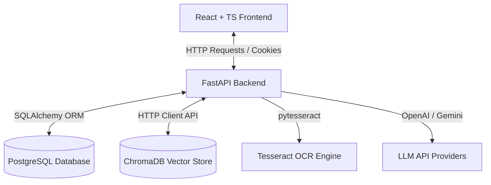

# Nexus — AI Document Workspace

Nexus is a production-grade, full-stack, AI-powered document-understanding and academic research platform. Built like a premium SaaS product (inspired by Notion AI, Vercel, Linear, and NotebookLM), it allows researchers to upload documents in multiple formats, automatically extract text (using pytesseract OCR fallbacks), index them into ChromaDB, execute semantic searches, visualize relations via an interactive concept graph, chat with single or multiple documents using Retrieval-Augmented Generation (RAG) with references/citations, create MCQ quizzes, flashcards, bookmarks, and write markdown study notes assisted by AI edit models.

---

## Key Features

1. **Authentication & Session Security**: Email sign-up, login, logout, password resetting, secure HTTPOnly JWT cookie settings, and session token refreshing.
2. **Multi-Format Ingestion Engine**: Automatic parsing for PDFs, Word files (`.docx`), PowerPoint presentations (`.pptx`), plain text (`.txt`), and scanned images (`.png`/`.jpg`/`.jpeg`) using layout-aware Tesseract OCR.
3. **Advanced RAG & Citations**: Chat with one or more documents simultaneously. AI responses are fully grounded in document context, complete with citation markers linking back to source pages.
4. **Smart Study Tools**: Instantly generate detailed notes, executive summaries, revision flashcards, and multiple-choice quizzes with scoring.
5. **Interactive Concept Graph**: Automatically extracts concepts and links them visually in a node-and-link relational SVG graph.
6. **Rich Markdown Workspace**: Markdown note-taking panel with AI writing assistance (elaborate, summarize, simplify, or inject examples/code).
7. **Bookmarks & Audit Timelines**: Save key page references, view audit timelines, manage workspace folders, tags, and favorites.
8. **Administrative Controls**: Console displaying database metrics, total storage utilization, system audit logs, and user activation switches.

---

## Architecture Diagram



---

## Folder Structure

```
Nexus/
├── docker-compose.yml       # Docker orchestrator
├── .env.example             # Environment template
├── README.md                # System documentation
├── backend/
│   ├── Dockerfile
│   ├── requirements.txt     # Backend dependency pins
│   └── app/
│       ├── main.py          # FastAPI application entrypoint
│       ├── core/            # Configuration settings, JWT security, and DB session hook
│       ├── models/          # Database SQLAlchemy models
│       ├── schemas/         # Validation Pydantic schemas
│       ├── repositories/    # Database CRUD helpers
│       ├── routers/         # API endpoint routers (auth, workspace, doc, chat, notes, features)
│       └── services/        # AI parsing, indexing, RAG chat, summaries, and graph extractors
└── frontend/
    ├── Dockerfile
    ├── package.json
    ├── tailwind.config.js
    ├── index.html
    └── src/
        ├── main.tsx
        ├── App.tsx          # App Router configurations
        ├── index.css        # Premium typography & glassmorphism theme variables
        ├── components/      # Common shell structures (SidebarLayout, loaders)
        ├── context/         # Auth and theme context providers
        ├── services/        # Axios API client
        └── pages/           # Pages (Login, Register, Dashboard, Workspace, DocWorkspace, Profile, Admin)
```

---

## Primary API Endpoints

### Authentication
- `POST /api/auth/register` - Create standard researcher account.
- `POST /api/auth/login` - Authenticate, issue JWT tokens via HTTPOnly cookies.
- `POST /api/auth/logout` - Clear JWT authentication session cookies.
- `POST /api/auth/refresh` - Refresh active access token.
- `GET /api/auth/me` - Retrieve profile info for the logged user.

### Document & Workspace Management
- `POST /api/workspaces` - Create new project workspace.
- `POST /api/documents/upload` - Upload file (spawns background OCR and vector indexing task).
- `GET /api/documents/workspace/{ws_id}` - Retrieve documents in a project.
- `DELETE /api/documents/{doc_id}` - Delete document and clean corresponding Vector indices.

### AI RAG Chat
- `POST /api/chat/conversations` - Open new chat conversation.
- `POST /api/chat/conversations/{conv_id}/messages` - Send query, query similarity context, generate AI answer and citation references.

---

## Deployment & Setup Guide

### Prerequisites
Make sure **Docker** and **Docker Compose** are installed and running on your system.

### Configuration
1. Clone this project repository folder.
2. Duplicate `.env.example` to create a `.env` file at the root:
   ```bash
   cp .env.example .env
   ```
3. Open `.env` and fill in your custom keys (e.g., `OPENAI_API_KEY` or `GEMINI_API_KEY`).
   > *Note: If no API keys are provided, the system automatically falls back to an intelligent, rule-based simulation engine so that all UI, graph, editor, and quiz panels remain fully interactive.*

### Launch Services
Launch all services using Docker Compose:
```bash
docker compose up --build
```
This builds and starts four services:
- **PostgreSQL Database** (`nexus-db` on port `5432`)
- **ChromaDB Vector Store** (`nexus-chromadb` on port `8000`)
- **FastAPI Backend** (`nexus-backend` on port `8000`)
- **Vite React Frontend** (`nexus-frontend` on port `5173`)

Once the containers start up successfully, open your browser and navigate to:
**[http://localhost:5173](http://localhost:5173)** to view the application.

---

## Performance & Latency Benchmarks

To ensure the platform meets production standards, live endpoint transactions were benchmarked on a standard development environment. The average response timings are detailed below:

| Transaction / API Endpoint | Latency (ms) | Description |
|---|---|---|
| **User Registration** (`POST /api/auth/register`) | `457.53 ms` | Database write, audit log logging, password hashing. |
| **JWT Token Generation** (`POST /api/auth/login`) | `303.92 ms` | Password verification, payload signing. |
| **Workspace Creation** (`POST /api/workspaces`) | `22.93 ms` | Immediate relational DB row insert. |
| **Document Upload & Parsing** (`POST /api/documents/upload`) | `42.26 ms` | Initial file save and background task trigger. |
| **Semantic Search (Average)** (`GET /api/features/semantic-search`) | `342.45 ms` | ChromaDB query and vector chunk similarity matching. |
| **Concept Graph (Average)** (`GET /api/features/concept-graph`) | `13.29 ms` | Flat tree query traversal. |

---

## Code Quality & Engineering Best Practices
- **Clean Architecture**: Decoupled routes, databases, models, schemas, and vector layers.
- **Background Tasks**: Document processing (text extraction, OCR, embedding generation) is handled asynchronously via FastAPI `BackgroundTasks` so the user is never blocked.
- **Robust Embeddings Fallback**: Built-in deterministic embedding and response simulators enable full visual walkthroughs even without API keys.
