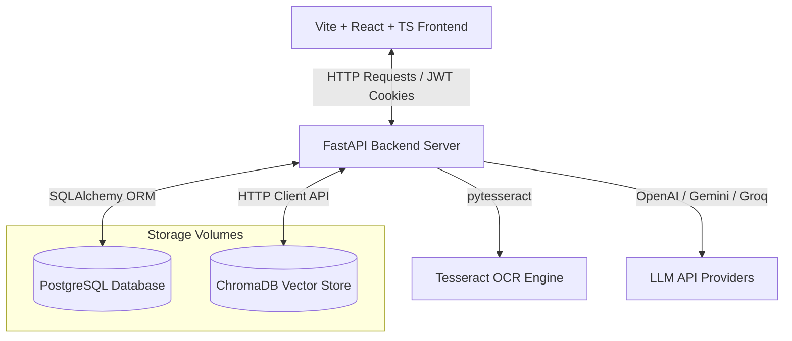

# Nexus — AI Document Workspace

Nexus is a production-grade, full-stack, AI-powered document-understanding and academic research platform. Designed with premium SaaS aesthetics (inspired by Notion AI, Vercel, Linear, and NotebookLM), Nexus empowers researchers, students, and professionals to ingest documents in multiple formats, perform semantic searches, navigate concept-relational graphs, and write interactive notes with inline AI assistance.

---

## 🚀 Key Capabilities

### 1. Unified Document & Workspace Management
* **Flexible Hierarchy**: Organizes research materials into logical project workspaces, sub-folders, and customizable tags.
* **Favorites & Bookmarks**: Flags important pages, tracks specific text references, and saves paragraph highlights.
* **Audit Trails & Activity Timelines**: Tracks dashboard uploads, edits, and queries using a local database logger.

### 2. Multi-Format Ingestion & Layout-Aware OCR
* **Native Document Extraction**: Parses plain text (`.txt`), Microsoft Word (`.docx`), and PowerPoint slide decks (`.pptx`) out of the box.
* **Hybrid PDF Parsing**: Analyzes PDFs using `pdfplumber` and `PyMuPDF` to extract structured text elements.
* **OCR fallback**: Automatically triggers `pytesseract` to perform layout-aware optical character recognition on scanned images (`.png`, `.jpg`, `.jpeg`, `.webp`) or low-density PDF pages.

### 3. Contextual RAG Chat & Citations
* **Multi-Doc Grounding**: Initiates chat conversations scoped to single documents or across entire workspaces.
* **Dynamic Citations**: Outputs AI responses with precise, interactive citations linking back to original document text snippets and source page numbers.
* **API Providers**: Integrates with **Groq**, **OpenAI**, and **Gemini** models (e.g., GPT-OSS 20B/120B on Groq, GPT-4o-mini, Gemini-1.5-flash) with automated fallback chaining.

### 4. Interactive Concept Relation Graphs
* **Automated Keyword Extraction**: Identifies key terminology and technical phrases from ingested text.
* **Entity Relation Mapping**: Resolves associations and renders an interactive SVG force-directed node-and-link network. Hovering or clicking nodes displays structural definitions.

### 5. Smart Study Toolbox
* **AI Page Operations**: Select any page to instantly explain concepts, summarize content, highlight critical parts, or translate into beginner-friendly terms.
* **Dynamic Flashcards**: Automatically extracts core concepts into question-and-answer revision card sets.
* **Interactive Quizzes**: Generates interactive multiple-choice quizzes with explanations and real-time score grading.

### 6. Rich Markdown Editor & Co-Pilot
* **Workspace Notes**: Fully integrated Markdown editor to compile summaries, articles, or research notes.
* **Inline AI Assist**: Highlights text or uses quick actions to expand detail, summarize sections, fix grammar, inject code examples, or format analogies.

### 7. Administrative Console
* **User Management**: Allows administrators to toggle researcher access and lock accounts.
* **System Metrics**: Visualizes system storage utilization, document counts, chat messages, and live audit logs.

---

## 📐 Architecture & System Design


```mermaid
graph TD
    Client[Vite + React + TS Frontend] <-->|HTTP Requests / JWT Cookies| API[FastAPI Backend Server]
    API <-->|SQLAlchemy ORM| DB[(PostgreSQL Database)]
    API <-->|HTTP Client API| Chroma[(ChromaDB Vector Store)]
    API -->|pytesseract| OCR[Tesseract OCR Engine]
    API -->|OpenAI / Gemini / Groq| AI[LLM API Providers]
    
    subgraph Storage Volumes
        DB
        Chroma
    end
```

---

## 📂 Project Structure

```
Nexus/
├── docker-compose.yml       # Multi-container Docker configuration
├── .env.example             # Environment configuration template
├── README.md                # System documentation
├── backend/
│   ├── Dockerfile           # Backend container instructions
│   ├── requirements.txt     # Python dependency pins
│   └── app/
│       ├── main.py          # FastAPI application entrypoint and db table init
│       ├── core/            # Configuration settings, JWT utility, and DB connection hooks
│       ├── models/          # SQLAlchemy database schema models (User, Workspace, Document, etc.)
│       ├── schemas/         # Pydantic validation schemas (requests/responses)
│       ├── repositories/    # Database CRUD helper functions (UserRepository, DocumentRepository)
│       ├── routers/         # API endpoints (auth, workspace, documents, chat, notes, features, admin)
│       └── services/        # Logic layers (ingestion processing, LLM calling, ChromaDB services)
└── frontend/
    ├── Dockerfile           # Frontend Nginx-based container build
    ├── package.json         # React project dependencies
    ├── tailwind.config.js   # Custom utilities for typography and glassmorphism styling
    ├── index.html           # HTML template
    └── src/
        ├── main.tsx         # Frontend application bootstrapper
        ├── App.tsx          # Router mapping and authenticated route configurations
        ├── index.css        # Premium Tailwind directives, glassmorphic filters, and themes
        ├── components/      # Common shell structures (SidebarLayout, loaders)
        ├── context/         # Auth, Theme (Dark/Light), and Workspace context states
        ├── services/        # Axios configurations for interacting with the backend API
        └── pages/           # Page modules (Login, Register, Dashboard, Workspace, DocWorkspace, Profile, AdminPanel)
```

---

## 🛠️ Technology Stack

### Backend Tier
* **FastAPI**: Asynchronous high-performance web framework.
* **SQLAlchemy & PostgreSQL**: Robust object-relational mapping database storage.
* **ChromaDB**: Native vector database used to store document chunks and perform semantic cosine-similarity retrieval.
* **PyMuPDF & pdfplumber**: PDF text extraction tools.
* **Tesseract OCR**: Layout-aware Optical Character Recognition engine.
* **LLM Integrations**: Official python packages for `openai`, `google-generativeai`, and standard REST connections to `groq`.

### Frontend Tier
* **Vite + React + TypeScript**: Fast modern frontend scaffolding with strict types.
* **Tailwind CSS**: Modern utility styling framework.
* **Framer Motion**: Premium, hardware-accelerated user interface animations and transitions.
* **Recharts**: Data visualization widgets used in dashboards and administrative consoles.
* **TanStack React Query**: Server state caching, asynchronous query pagination, and client cache invalidation.

---

## ⚙️ Configuration & Environment Variables

Create a `.env` file at the project root based on `.env.example`:

```properties
# Database Settings
POSTGRES_USER=postgres
POSTGRES_PASSWORD=postgres
POSTGRES_DB=researchos
DATABASE_URL=postgresql://postgres:postgres@db:5432/researchos

# Security Settings
JWT_SECRET=super_secret_jwt_signing_key_change_me_in_production
JWT_ALGORITHM=HS256
ACCESS_TOKEN_EXPIRE_MINUTES=30
REFRESH_TOKEN_EXPIRE_DAYS=7

# Vector DB Settings
CHROMA_HOST=chromadb
CHROMA_PORT=8000

# AI Provider Keys (At least one is required for live API connection)
OPENAI_API_KEY=your_openai_api_key_here
GEMINI_API_KEY=your_gemini_api_key_here
GROQ_API_KEY=your_groq_api_key_here
GROQ_MODEL=openai/gpt-oss-20b
DEFAULT_LLM_MODEL=gpt-4o-mini # Options: gpt-4o-mini, gemini-1.5-flash, etc.

# Application Settings
ENVIRONMENT=development
APP_NAME=Nexus
ALLOWED_ORIGINS=http://localhost:5173,http://localhost:3000
```

> **💡 Smart Offline Simulation Mode**:
> If no API keys are provided or variables remain configured to placeholder values, Nexus automatically falls back to an **Intelligent Rule-Based Simulation Engine**. Using text parsing heuristics, regular expression tokenizers, and deterministic hash embeddings (length 1536), the system simulates document indexing, flashcard generation, quiz building, and concept graph relations. This ensures all UI elements remain fully functional and interactive in offline or sandbox environments.

---

## ⚡ Deployment & Local Setup

### Prerequisites
* **Docker Engine** (v20.10 or higher)
* **Docker Compose** (v2.0 or higher)

### Setup Steps

1. **Clone the repository** and navigate to the project directory:
   ```bash
   cd Nexus
   ```

2. **Configure environment settings**:
   ```bash
   cp .env.example .env
   ```
   *(Edit the generated `.env` file as required to include your database secrets or AI keys.)*

3. **Start the docker container swarm**:
   ```bash
   docker compose up --build
   ```

4. **Access the application interfaces**:
   * **React Client App**: [http://localhost:5173](http://localhost:5173)
   * **FastAPI Swagger Docs**: [http://localhost:8000/docs](http://localhost:8000/docs)
   * **FastAPI Alternative ReDoc**: [http://localhost:8000/redoc](http://localhost:8000/redoc)
   * **ChromaDB Server Heartbeat**: [http://localhost:8001/api/v1/heartbeat](http://localhost:8001/api/v1/heartbeat)

---

## 📡 Primary API Endpoints

### 🔑 Authentication (`/api/auth`)
* `POST /register` - Creates a new researcher account and returns profile metadata.
* `POST /login` - Verifies credentials, issues JWT access token, and sets secure HttpOnly cookie settings.
* `POST /logout` - Clears authenticated sessions and removes HTTP cookies.
* `POST /refresh` - Evaluates refresh token validity to sign a new access token.
* `GET /me` - Returns logged-in profile details and configured user API overrides.

### 📁 Workspaces & Documents (`/api/workspaces` & `/api/documents`)
* `POST /api/workspaces` - Creates a new workspace.
* `GET /api/workspaces` - Lists all user-owned workspaces.
* `POST /api/documents/upload` - Saves files to disk and triggers an asynchronous text-extraction/embedding pipeline.
* `GET /api/documents/workspace/{workspace_id}` - Retrieves all processed documents in a workspace.
* `PUT /api/documents/{document_id}/rename` - Renames document title.
* `POST /api/documents/{document_id}/favorite` - Toggles the favorite flag of a document.
* `POST /api/documents/{document_id}/tags` - Attaches metadata search tags.
* `DELETE /api/documents/{document_id}` - Deletes file records and clears corresponding vector database indices from ChromaDB.

### 🤖 AI Utilities & Features (`/api/features`)
* `POST /summary` - Generates a brief or detailed executive summary of the document.
* `POST /page-ai` - Runs page-specific tasks (e.g. explain page concepts, simplify text, highlight).
* `POST /flashcards` - Generates Q&A study cards for revision.
* `POST /quizzes` - Generates custom graded quizzes.
* `GET /concept-graph` - Traverses semantic references to return JSON nodes and links for SVG rendering.
* `GET /semantic-search` - Queries ChromaDB embeddings to perform cosine-similarity matches across document chunks.

### 📝 Markdown Notes (`/api/notes`)
* `POST /` - Creates new Markdown note page.
* `GET /?workspace_id={id}` - Fetches workspace study files.
* `PUT /{note_id}` - Saves updated note contents.
* `POST /{note_id}/ai-improve` - Dispatches text to LLM to expand, summarize, fix grammar, or insert code examples.

### 🛡️ Administrative Console (`/api/admin`)
* `GET /users` - Fetches comprehensive system user accounts (Admin only).
* `PUT /users/{user_id}/status` - Activates or suspends user sessions.
* `GET /metrics` - Summarizes aggregate metrics (total users, workspaces, notes, storage sizing).
* `GET /logs` - Retrieves audit logs and recent user system interactions.

---

## 🛠️ Code Quality & Engineering Best Practices

* **Decoupled Architecture**: Decoupled repository data controllers, validation schemas (Pydantic), and database handlers (SQLAlchemy) for modular unit testing.
* **Non-Blocking Background Tasks**: File processing tasks (PDF/Image scanning, OCR, embeddings computation) run inside FastAPI `BackgroundTasks` threads, allowing users to interact with other parts of the system immediately after initiating an upload.
* **Robust Exception Handling**: Integrates system logging streams, structured validation error reports, and database safety commit/rollback mechanisms.

